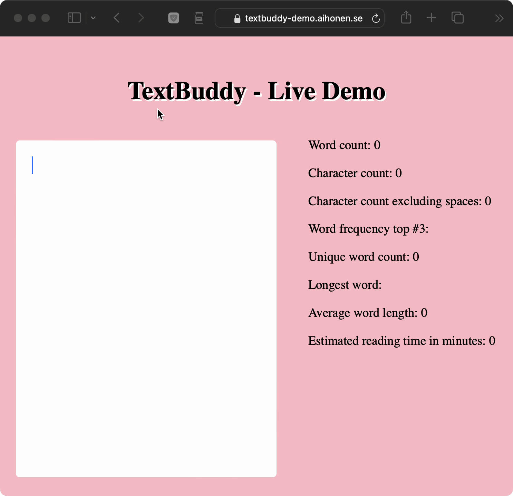

## ⚠️ Warning
IT IS RECOMMENDED TO WAIT UNTIL VERSION 1.0.0 BEFORE USING THIS PACKAGE IN PRODUCTION ENVIRONMENT.

## TextBuddy
**TextBuddy** is a JavaScript module for text analysis. TextBuddy can assist you with a wide range of tasks - from simple character and word count to chatbot integration with OpenAi's API.  

Textbuddy was created and is maintained by a student at Linneuniversiteten in Sweden. It was created for an assignment in the course Introduction to software quality.

Once the module reaches version 1.0.0, it will be suitable be used by any project that needs a simple, dependency-free, modern, module for analysing text.

**Table of contents**
- [Live demo](#features-and-documentation)
- [Code example](#code-example)
- [Getting started](#getting-started-)
- [Dependencies](#dependencies)
- [Features and documentation](#features-and-documentation)
- [Known issues](#known-issues)
- [Version history](#version-history)
- [Test reports](#test-reports)
- [Do you want to contribute to the project?](#do-you-want-to-contribute-to-the-project?)

## Live demo

**Live demo**: https://textbuddy-demo.aihonen.se  
**Repository for the live demo**: https://github.com/ta223dh/TextBuddy-Demo 

_Note: Live demo has not yet incorporated the modules Ai-features._



## Code example

```javascript
const text = new TextBuddy('This is a text in English. It consists of eleven words.')
const wordCount = text.wordCount() // 11

text.setOpenAiApiKey('your-api-key')
const language = text.aiGetLanguage // en 
```

## Getting started 
**Using the module**:
- Installation: `npm i textbuddy`

**Developing the module**:
- `git clone` the project repo to your local folder
- `cd TextBuddy` to navigage into the folder
- `code .` to open the project in your code editor
- Unit tests: `npm run test`
- Check lint issues: `npm run lint`
- Automaticallt fix lint issues (if possible): `npm run lint:fix`

## Dependencies
**Basic features**:
- TextBuddy is created from the ground up without any dependence on external libraries. The code is all written in modern javascript.

**Chatbot integration**:
- Provide your own API key, and TextBuddy will be able to utilize OpenAi's API for chat completion. This will require a network call to OpenAi's servers. For costs, limitations and privacy policy, refer to your OpenAi account agreement.

https://platform.openai.com/account/api-keys

## Features and documentation
**Basic**
- [wordCount () ](module_documentation.md#wordcount-)
- characterCount ()
- characterCountExcludingSpaces ()
- wordFrequency ()
- uniqueWordCount ()
- longestWord ()
- averageWordLength ()
- esimatedReadingTimeInMinutes ()
- wordFrequencyOfWord (word)

**Ai**
- setOpenAiApiKey (key)
- aiGetLanguage ()

## Known issues
- The live demo needs to be updated to use the Ai-features.
- The word counter should not count a single special character as a word. See issue: 

## Version history
See [version history](https://github.com/ta223dh/TextBuddy/releases/)

## Test reports
See [test reports](test_reports.md)

## Do you want to contribute to the project?
Create an issue on github to report a bug or suggest a new feature. Make a Pull request to contribute new code. Check the issue list to see if there already is an existing issue before creating a new one.

**Bug report**:
- Explain the steps to reproduce, actual behaviour and expected behaviour
- Module version (for example TextBuddy 0.0.12)
- Environment (for example Nodejs 18.18.0 LTS or Firefox 118.0).

**Feature request**:
- Explain the feature, expected input and output, and why it is needed.

**Pull requests**:  

For code contributions, the following requirements must be fullfilled:  

- Feature or bug has been described in an existing issue
- Code is documented with JSDoc
- Code is using modern javascript syntax (ECMAScript 6 and later)
- No dependencies on third party modules
- Unit tests are added for the new feature
- Unit tests (new and old) runs with 0 fails
- Lint runs with 0 warnings

A code review will then be conducted by the repository owner before merging.