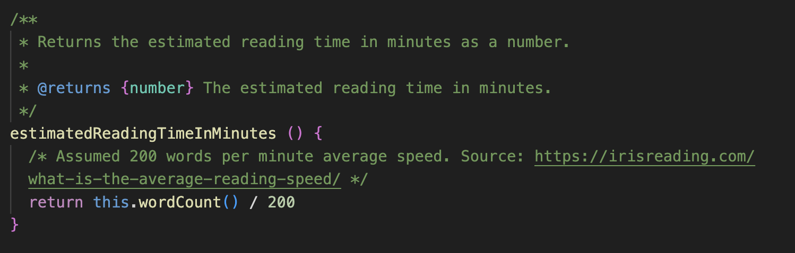

## Chapter 2: Meaningful names

Kapitel 2 var enligt mig ett av de bästa kapitlen. Mycket går att vinna genom att ha meningsfulla namn. Namn som går att uttala, namn som demonstrerar syftet och namn som inte är missvisande.

Ett eget exempel är att min kod itererade igenom key & values i ett objekt. Under workshop 2, så gick en annan student igenom denna kod, och det var svårt för studenten att veta vad dessa key & values representerade. Det krävdes mental mappning, alltså att hålla koll i huvudet vad som fanns i detta objekt, för att helt kunna förstå koden. Denna kod har jag sedan dess förbättrat enligt nedan, med att byta ut key & value till word och frequenzy.

Två andra exempel som jag upplevde under workshops var att:

Under workshop 1 så hade den andra gruppen vars kod jag skulle förstå en prefix för sina webkomponenter. Det var något i stil med UYDF. Detta var förvirrande för mig, jag visste inte hur detta skulle uttalas (pronouncable names) och jag visste inte vilken information som jag skulle läsa ut ur detta. Det visade sig efteråt att det bara vara en slumpad sträng som prefixade webkomponenten.

Under workshop 2 så fanns det i koden som jag undersökte en del gammal dokumentation och rent av felaktiga namngivningar (avoid disinformation). Detta visste jag såklart inte när jag försökte förstå koden. Då programmer handlade om en domän som jag inte har någon vidare kunskap i, så var jag mycket beroende av dokumentationen och namngivning, och det blev förvirrande när min förståelse av koden gjorde till och med tvärt emot vad namngivningen och dokumentationen beskrev. Detta var för att implementationen hade ändrat sig sedan dokumentationen och namngivningen gjordes, dokumentationen och namngivingen hade inte uppdaterats. Lösningen i sig var korrekt och fungerande, men namngivingen och dokumentationen var missvisande.

## Chapter 3: Functions

Detta kapitel syfar på att funktioner ska vara så små som möjligt, göra så få saker som möjligt (helst 1 sak), ha så få parametrar som möjligt, hantera så få abstraktionsnivåer som möjligt (helst 1 nivå) och inte ha några sidoeffekter. Slutsatsen är att en funktion ska vara så kort och enkel, att den går att läsa och överblicka utan problem. Det är sedan flera funktioner som löser problemet som helhet, och varje funktion ska vara enkel i sig.

I kursens workshops så upplevde jag att detta stämde - när jag läser kod så är det alltid enklare att förstå en mindre funktion (om den har meningsfulla namn, inte är ett "train-wreck" etc.) En funktion började kännas förrvirrande redan vid ca 10 rader kod.

När jag skriver kod, så upplever jag dock en stark vilja att hålla ihop funktionalitet. T.ex så argumenterar boken att error handling är "1 sak", och att det bör brytas ut. Men t.ex. i funktionen nedan så har jag valt att ha error handling i funktionen, för att hålla ihop koden och inte sprida ut den. Om alla funktioner skulle reduceras till minimum, så skuylle det bli väldigt många funktioner i denna klass. En reflektion kring detta är att det kanske fungerar bra om man då även skapar flera klasser och "håller ihop" funktionaliteten på det viset. Det går alltså inte att rakt av applicera en regel från boken, ibland så skulle även en liten regel kräva stora omskrivningar av koden.

## Chapter 4: Comments

Kapitlet argumenterar för att kommentering av kod till stor del är redundant. Bra namngivning av klasser, funktioner och variabler kan göra att kommentarer inte behövs. I fall där kommentarer används, så ska den istället tillföra något annat, t.ex: Förklara ett specifikt val, ge information om konsekvenser, och dokumentera saker som ska göras / ej är implementerad genom att använda "TODO".

Ett exempel på detta i projektets kod är att förklara varför genomsnittsläshastigheten är satt till 200 år. Detta görs genom att skriva att det är en assumption och hänvisa till en källa.

## Chapter 5: Formatting

Kapitler argumenterar för att vertikal formatering, längd på en fil, ska hållas någonstans mellan 200-500 rader. Vertikal densitet, öppenhet och mellanrum mellan koncept, ökar läsbarheten. Vertikal distans betyder att kod som hör ihop, ska skrivas nära varandra.

Vid formattering så argumenterar boken för att det viktigt att följa gemensamma formateringsregler. Det viktigaste är alltså inte exakt vad reglerna är, utan att all kod följer samma regler. I detta projekt så kan det ses genom att kodstandard för webbutvecklingskurserna används. Denna standard är alla elever på kursen välbekanta med, vilket gör det enklare att sätta sig in i varandras projekt.

Ett  exempel på vertikal distans är att en privat metod ligger direkt under dom publika metoderna som använder sig av den. Se bild nedan.

## Chapter 6: Objects and data structures

Detta kapitel handlar bland annat om skillnaden mellan objekt och datastrukturer. Objekt bör dölja sina värden, och exponera funktionalitet. Datastrukturer exponerar sina värden, men har ingen funktionalitet.

Det finns en regel som kallas för "Law of Demeter", denna säger att man ska prata med vänner, inte med främlingar. Vad som menas med detta är att man bör använda språkets funktioner, samt funktioner på medlemmar, argument eller egenskapade objekt. Man bör inte använda funktioner på "främmande" objekt som har returnerats av någon av dessa objekt. Istället bör man be objektet att göra något (och hantera dessa funktionsanrop internt). Det kan annars leda till sk. "train-wrecks", som är långa funktionsanrop på nya returnerade objekt efter varandra.

Det närmast ett "train wreck" som hittas i detta projekt är koden nedan. Den är därför utbryten till en privat metod med ett beskrivande metodnamn. Notera att den använder sig av språkets stringmetoder, det är därför inga riktiga "främlingar" i detta fall.

## Chapter 7: Error Handling

Kapitel sju argumenterar för att felhantering bör skötas genom att kasta undantag. Funktioner bör inte returnera null eller en statuskod. Ett exempel i detta projekt är metoderna som använder OpenAi's API. Dessa kastar ett undantag om anslutningen misslyckades, eller om server returnerar en felkod. Den inkluderar även anledningen till att undantaget kastades, för att underlätta felsökning (Provide Context With Exceptions).

## Chapter 8: Boundaries

Detta kapitel handlar om tredjepartskod. Ett sätt att använda sig av kod från en tredje part, är att börja med att skapa test och se hur koden beter sig. Detta kallas för "learning tests". Enligt min uppfattning så är det ett sätt som är mycket likt TDD, men att man fokuserar på användet av ett tredjeparts api / modul istället för att skriva egen kod. Dessa learning tests kan sedan användas för att bekräfta att tredjepartskoden fortfarande beter sig som förväntad och som det behövs för applikationen. Detta blir då automatiska tester som kan köras t.ex. efter att tredjepartsmodulen har uppdateras.

I detta projekt så finns automatiska tester mot OpenAi's API. Genom att regelbundet köra testerna, så kan jag upptäcka ändringar hos OpenAi och bli notifierad när min implementation inte längre fungerar.

## Chapter 9: Unit tests

Kapitlet handlar om enhetstest och TDD (Test Driven Development,). Enhetstester är små tester som testar en enhet och har en assert (förväntat beteende) per test. TTD har tre "lagar": 1) Ingen kod ska skrivas innan det finns ett test som misslyckas. 2) Testet ska vara så grundläggande som möjligt för att misslyckas. 3) Det får inte skrivas mer kod än för att uppfylla testet.

Detta gör så att all kod alltid grundar sig på att det finns ett testfall som ska uppfyllas. 

I detta projekt så används enhetstester, men följde inte TDD. Enhetstesterna har dock varit till stor hjälp, då det har skapat ett förtroende till att kunna göra ändring i modulen och vara säker på att ingen av den specificerade funktionaliteten har slutat fungera. Detta har gjort så att det känns enkelt att göra ändring i modulen. Om jag inte hade haft enhetstester så hade jag nog varit rätt för att göra ändringar, då jag inte kunde känna mig säker på att något i modulen skulle sluta fungera.

## Chapter 10: Classes

Kapitlet om klasser känns till stor del mycket liknande tidigare kapiel. Inkapsling av data ska användas, klasser ska vara små, klasser bör baseras på SRP (Single Responsbility Principle) som säger att klasser ska begränas till att ansvara över en sak och därför bara har en anledning att förändras. Klasser bör konstueras för att tillåta att system som helhet kan förändras.

I projektets webbapplikation så har appen delats upp i webbkomponenter. Där chatten är en separat webkomponent som kan lyftas ut och sättas in i ett annat projekt.

## Chapter 11: Systems

Detta kapitel argumenterar för att även system som helhet behöver vara "clean". Ett system jämförs med en stad, där olika departement och olika specialister arbetar på olika abstraktionsnivåer. Ingen enskils person kan hålla koll på allts som krävs för att få en stad att fungera. Ett sätt att bygga ett modulärt system är att använda sig av Dependency Injection. Detta innebär att skapandet av objekt flyttas från användandet av objektet. Denna separation gör det möjligt att testa separata delar av system genom t.ex. mocka objekt som behövs.

Ett sätt som detta projekt är "clean" på systemnivå, är uppdelningen mellan modulen och applikationen. Modulen i sig är helt fristående och har ingen dependency på applikationen. Applikationen i sin tur har definierat en specifik version av modulen som ska användas.

För ytterligare "clean code", så skulle applikationen kunna definiera ett interface som den använder sig av. Sedan även modulerna vara enkla att byta ut då, då modulerna bara behöver kopplas till att uppfylla interfacets specifikationer.